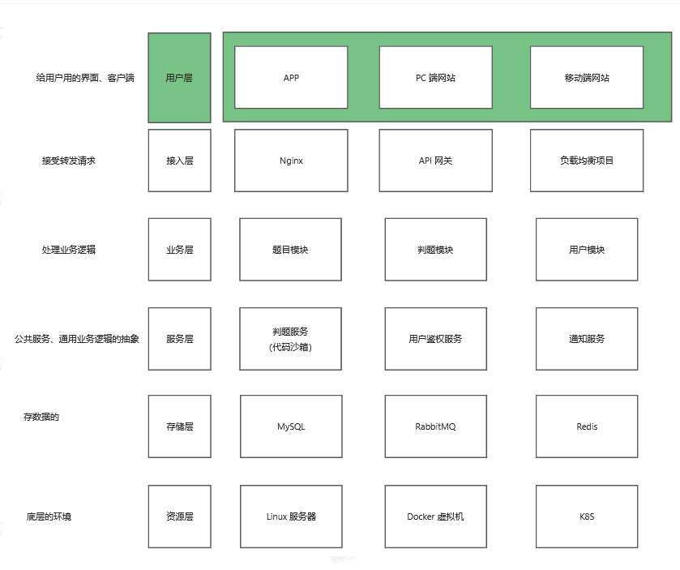
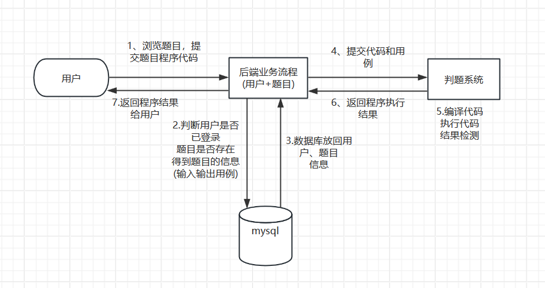
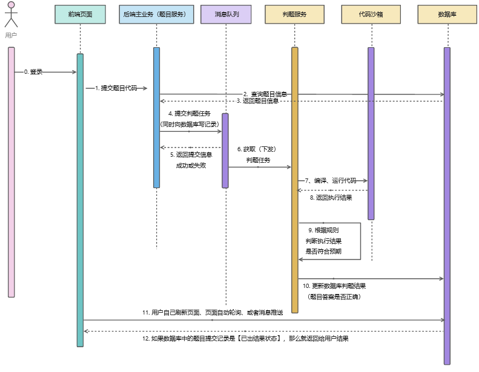
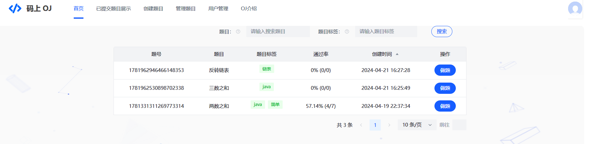
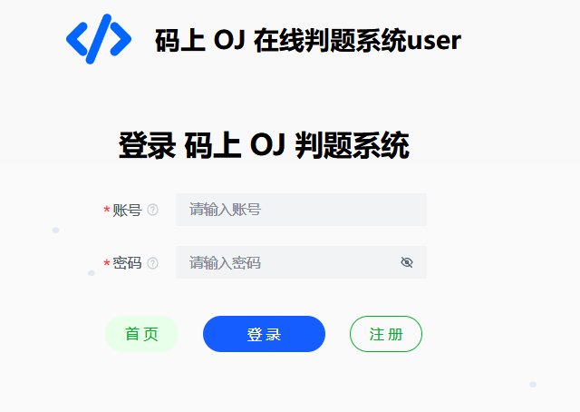
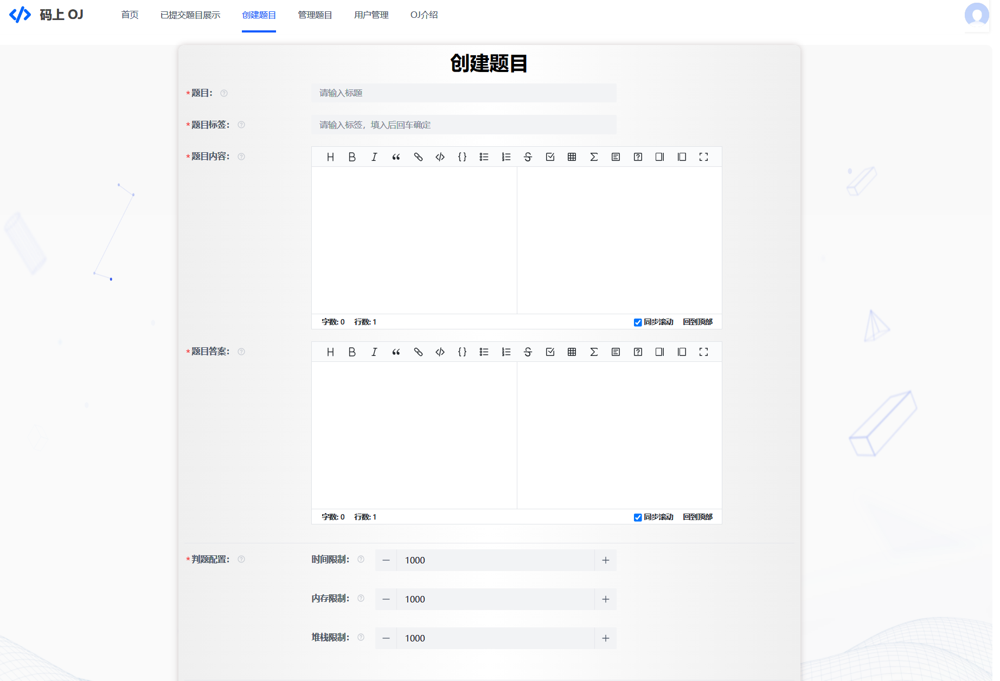
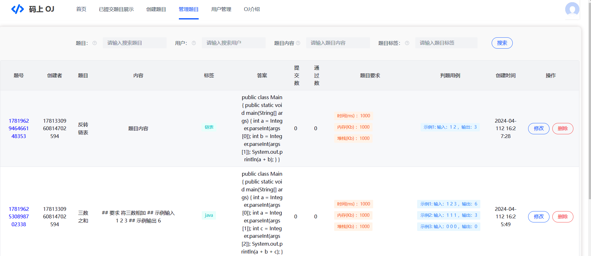
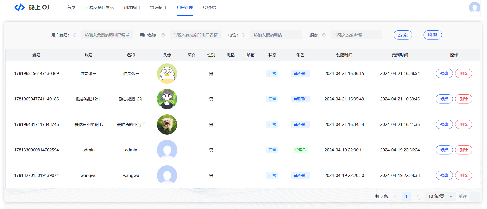
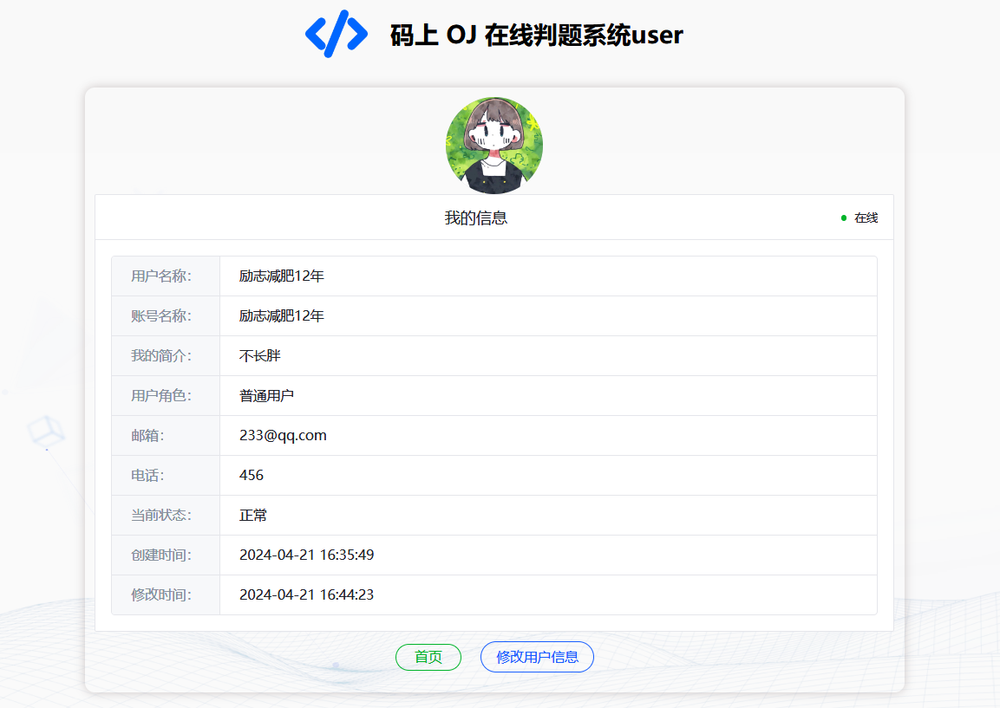
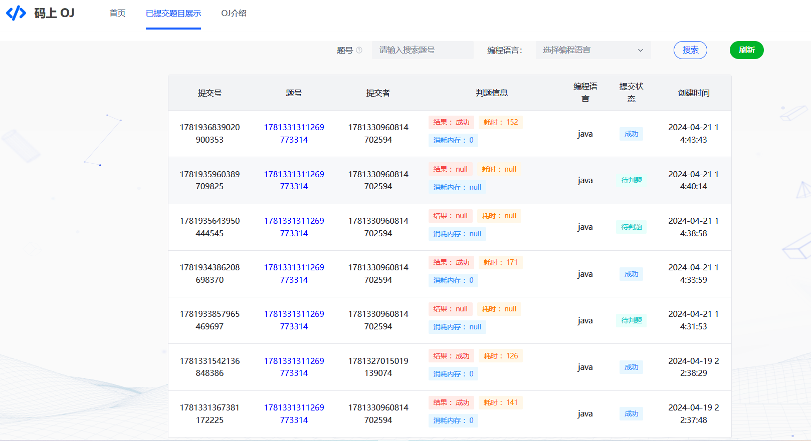

# 码上 Online Judge

> 作者：[西尾coding](https://github.com/xiweicoder)

## 项目介绍

本项目是基于 Spring Boot + Spring Cloud Alibaba 微服务 + Docker + RabbitMQ + Vue 3 的 **编程算法题目在线评测系统**
（简称OJ）。

XW OJ（Cat Online Judge）系统是一个在线算法评测系统，用户可以选择题目、编写代码并提交代码进行评测，而且是高效、稳定的 OJ
在线判题评测系统，它能够根据用户提交的代码、出题人预先设置的题目输入和输出用例，进行编译代码、运行代码、判断代码运行结果是否正确。

## 项目功能 

### 题目模块

1. 创建题目（管理员）
2. 删除题目（管理员）
3. 修改题目（管理员）
4. 搜索题目（用户/管理员）
5. 题目管理（管理员）
6. 在线做题（用户/管理）
7. 提交题目代码（用户/管理）
8. 消息队列：防止判题服务执行时间过长，并使用死信队列处理判题失败的题目，避免消息积压。

### 用户模块

1. 注册
2. 登录，在微服务中使用JWT Token实现登录，在网关层面获取token登录消息，实现用户鉴权
3. 用户管理（管理员）
4. 用户上传头像功能，使用阿里云对象存储OSS存储图片
5. 用户限流。本项目使用到令牌桶限流算法，使用Redisson实现简单且高效分布式限流，限制用户每秒只能调用一次提交一次题目，防止用户恶意占用系统资源

### 判题模块

1. 提交判题：结果是否正确与错误
2. 错误处理：内存益出、安全性、超时
3. 代码沙箱：执行代码，返回执行信息
4. 开放接口：提供一个独立的新服务

### 代码沙箱
- 只负责接受代码和输入，运行代码，返回编译运行的结果，不用管用户提交的程序是否正确(不负责判题)

## 项目核心亮点 ⭐

1. 权限校验：用户权限校验
2. 代码沙箱（安全沙箱）
    - 用户代码藏毒：写个木马文件、修改系统权限
    - 沙箱：隔离的、安全的环境，用户的代码不会影响到沙箱之外的系统的运行
    - 资源分配：限制用户程序的占用资源
3. 判题规则
    - 题目用例的比对，结果的验证
4. 任务调度（消息队列执行判题）
    - 服务器资源有限，用户要排队，按照顺序去依次执行判题

## 快速启动 🏃‍♂️

1. 下载/拉取本项目到本地（xwoj-backend-single、xwoj-code-sandbox、xwoj-frontend）
2. 通过 IDEA 代码编辑器进行打开项目，等待依赖的下载
3. 修改配置文件 `application.yaml` 的信息，比如数据库、Redis、RabbitMQ等
4. 修改信息完成后，通过 `MainApplication` 程序进行运行项目

## 项目结构图 🌟

## 项目核心业务流程 🔥

判题服务：获取题目信息、预计的输入输出结果，返回给主业务后端：用户的答案是否正确
代码沙箱：只负责运行代码，给出程序运行的结果，不用管用户提交的程序是否正确。 因此 判题服务 和 代码沙箱 实现了解耦

核心流程时序图

## 项目技术栈和特点 ❤️‍🔥

### 后端

1. Spring Boot：简化Spring开发框架
2. Spring MVC：
3. Spring Boot 调试工具和项目处理器
4. Spring AOP 切面编程
5. Spring 事务注解
6. Spring Cloud Alibaba
7. Spring Gateway
8. MyBatis + MyBatis Plus 数据访问（开启分页）
9. MyBatis-Plus 数据库访问结构
10. Redis：分布式存储用户信息
11. Redisson：限流控制
12. JWT Token：用户鉴权
13. RabbitMQ：消息队列
14. Docker 代码沙箱，实现隔离环境运行Java程序
15. Java安全管理器：保护 JVM、Java 安全的机制，实现对资源的操作限制
16. Nacos：服务注册管理中心
17. OpenFeign：微服务模块之间调用

### 前端

1. Vue 3
2. Vue Router: 路由管理
3. Vue-Cli 脚手架
4. Axios: HTTP客户端
5. Bytemd: Markdown 编辑器
6. Monaco Editor: 代码编辑器
7. highlight.js: 语法高亮
8. Moment.js: 日期处理库
9. Arco Design Vue: UI组件库
10. TypeScript: 静态类型系统

### 数据存储

- MySQL 数据库
- 阿里云 OSS 对象存储

### 通用特性

- Spring Session Redis 分布式登录
- 全局请求响应拦截器（记录日志）
- 全局异常处理器
- 自定义错误码
- 封装通用响应类
- Swagger + Knife4j 接口文档
- 自定义权限注解 + 全局校验
- 全局跨域处理
- 长整数丢失精度解决
- 多环境配置
- IDEA插件 MyBatisX ： 根据数据库表自动生成
- Hutool工具库 、Apache Common Utils、Gson 解析库、Lombok 注解

### 设计模式

- 静态工厂模式
- 代理模式
- 策略模式

## OJ项目展示

### 项目首页

### 用户登录注册

### 管理员创建题目

### 题目管理

### 修改题目信息

### 用户管理（管理员）

## 管理员修改用户信息

### 个人信息

### 提交题目展示

## 后续项目扩展

- 多语言代码沙箱

